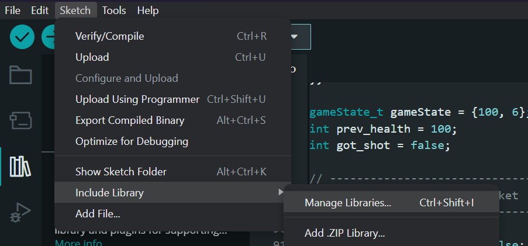

# CG4002 Hardware

## Download MPU6050 Libary
* Go to [MPU6050 Library Github](https://github.com/jarzebski/Arduino-MPU6050) and download the zip code file.
* Follow the steps [here](https://wiki.seeedstudio.com/How_to_install_Arduino_Library/#:~:text=Since%20you%20have%20downloaded%20the,the%20library%20is%20installed%20successfully 'How to install an arduino library') to install the MPU6050 library.

## Download remaining libraries
* Open Arduino IDE and click `Sketch > Include Library > Manage Libraries..`

* Search and download `IRremote.h` and `FastLED.h`

## Upload Code to Hardware
* Connect the hardware to the laptop
* Open up the respective hardware component code in Arduino IDE and click on `Upload` under the `Sketch` toolbar. 
